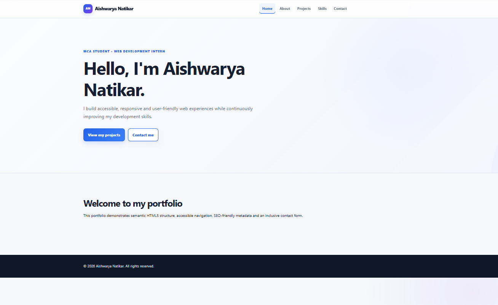
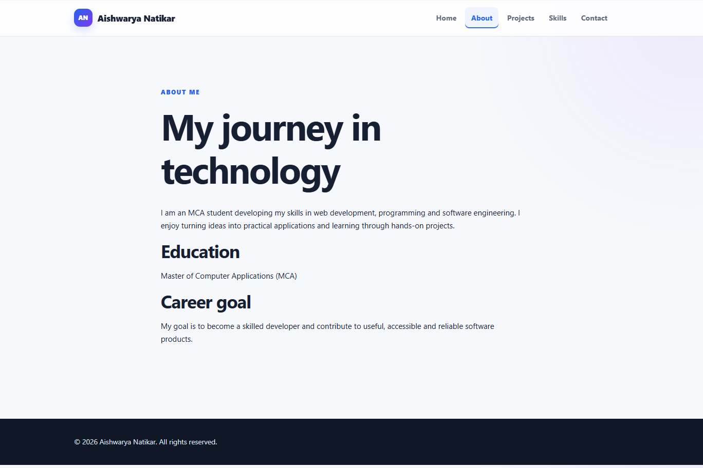
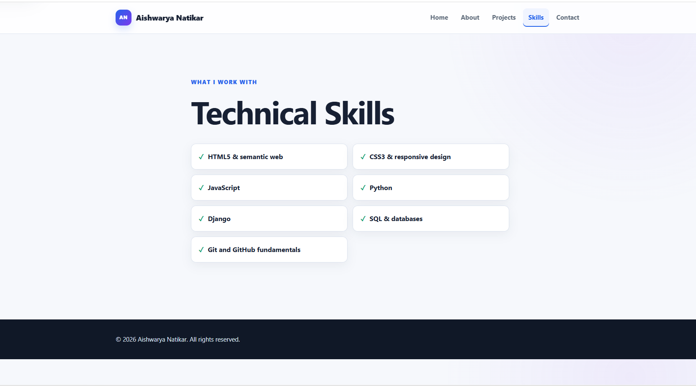
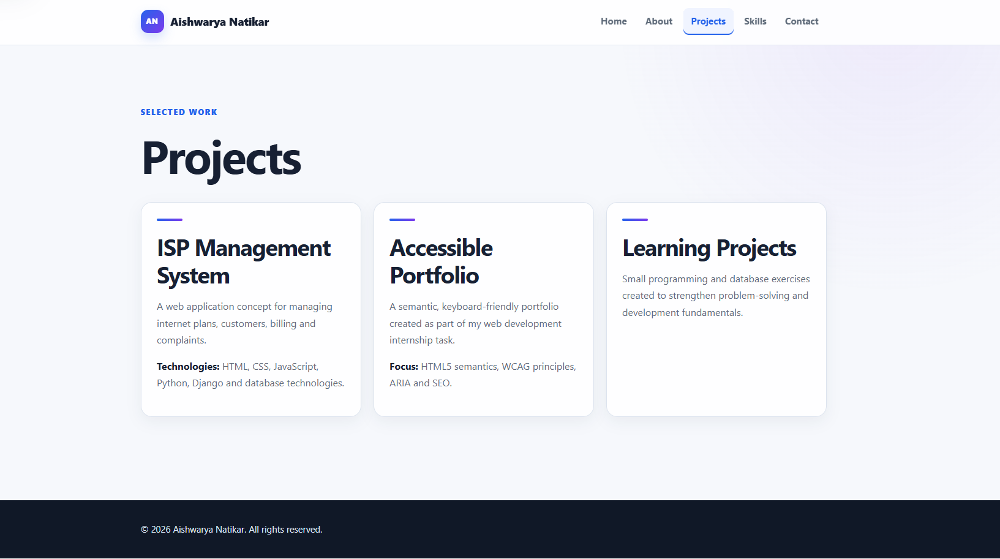
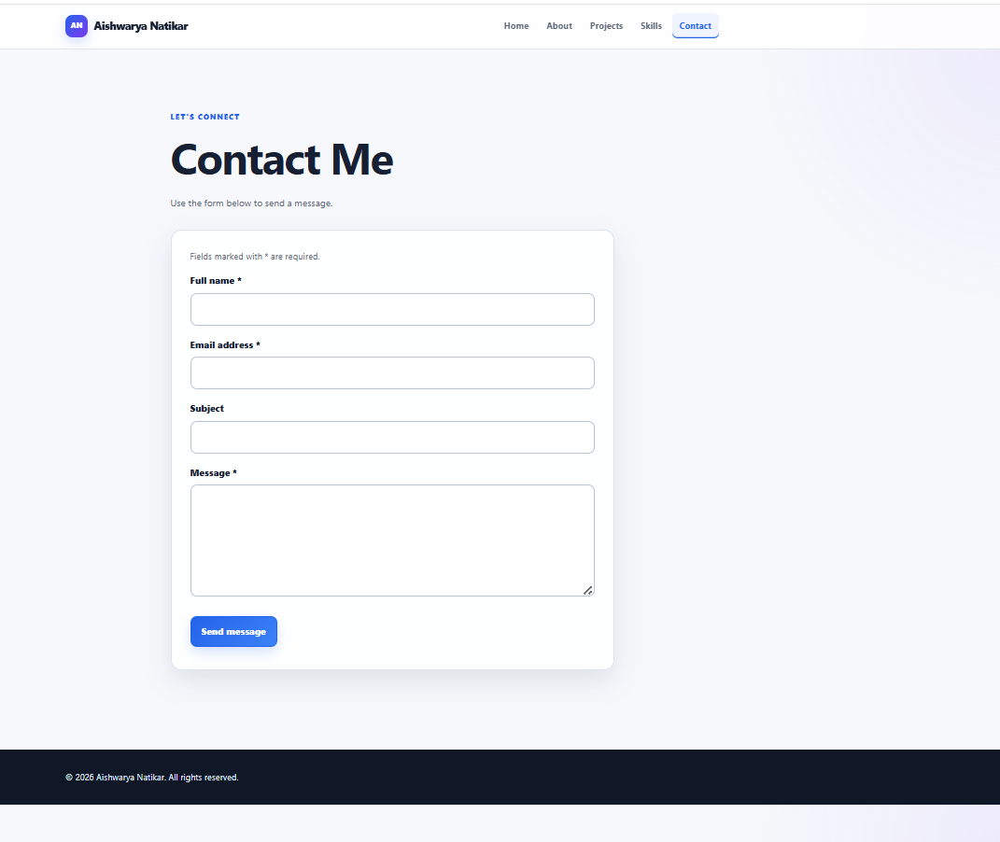

# Aishwarya Natikar — Professional Portfolio

A modern, responsive and accessible personal portfolio website developed as part of my **Thiranex Internship – Task 1**.

The project demonstrates practical knowledge of **HTML5, CSS3, JavaScript, Python and Django**, with a focus on semantic structure, accessibility, responsive design and professional web development.

---

## 👩‍💻 About Me

Hello! I'm **Aishwarya Natikar**, an MCA student interested in full-stack web development.

I enjoy building clean, responsive and user-friendly web applications. This portfolio represents my academic background, technical skills, projects and development journey.

### Career Goal

My goal is to build a career as a **Software Developer / Full-Stack Developer** and contribute to real-world software development projects.

---

## 🎯 Project Objective

The main objective of this project is to develop a professional personal portfolio website that:

- Presents my academic and technical background
- Showcases my skills and projects
- Provides an accessible contact form
- Uses modern responsive design
- Follows semantic HTML5 standards
- Implements accessibility best practices
- Demonstrates Django backend integration
- Provides a professional developer-style interface

---

## ✨ Features

### Frontend

- Semantic HTML5 structure
- Responsive design for mobile, tablet and desktop
- CSS Grid and Flexbox
- Modern CSS3 architecture
- Light/Dark theme support
- Responsive navigation
- JavaScript interactions
- Smooth scrolling
- Scroll progress indicator
- Reveal animations
- Keyboard-friendly navigation
- Accessible contact form
- SEO-friendly meta information

### Backend

- Django framework
- Django URL routing
- Django views
- Django templates
- Django models
- SQLite database
- Contact form processing
- CSRF protection
- Django Admin support

---

## 🌐 Portfolio Pages

| Page | Description |
|---|---|
| 🏠 **Home** | Introduction, profile summary and portfolio highlights |
| 👩 **About** | Academic background, career goals and personal information |
| 🛠️ **Skills** | Technical skills and development technologies |
| 🚀 **Projects** | Projects developed and showcased in the portfolio |
| 📧 **Contact** | Accessible contact form for communication |

### Application Navigation

**Home → About → Skills → Projects → Contact**

---

## 🛠️ Technologies Used

| Technology | Purpose |
|---|---|
| HTML5 | Semantic website structure |
| CSS3 | Responsive and modern UI design |
| JavaScript | Website interactions |
| Python | Backend programming |
| Django | Full-stack web framework |
| SQLite | Database |
| Git | Version control |
| GitHub | Source code hosting |
| VS Code | Development environment |

---

## 📸 Portfolio Screenshots

### 🏠 Home Page



### 👩 About Page



### 🛠️ Skills Page



### 🚀 Projects Page



### 📧 Contact Page



---

## 📂 Project Structure

```text
aishwarya-thiranex-portfolio/
│
├── manage.py
├── README.md
├── requirements.txt
├── .gitignore
│
├── screenshots/
│   ├── homepage.png
│   ├── about.png
│   ├── skills.png
│   ├── projects.png
│   └── contact.png
│
├── portfolio/
│   ├── admin.py
│   ├── apps.py
│   ├── models.py
│   ├── views.py
│   │
│   ├── migrations/
│   │   └── 0001_initial.py
│   │
│   ├── static/
│   │   └── portfolio/
│   │       ├── css/
│   │       │   └── style.css
│   │       └── js/
│   │           └── main.js
│   │
│   └── templates/
│       └── portfolio/
│           ├── base.html
│           ├── index.html
│           ├── about.html
│           ├── projects.html
│           ├── skills.html
│           └── contact.html
│
└── portfolio_project/
    ├── __init__.py
    ├── settings.py
    ├── urls.py
    ├── asgi.py
    └── wsgi.py